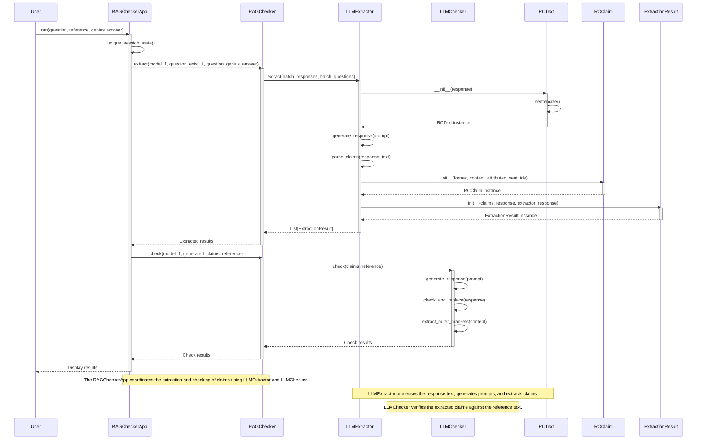

```mermaid
sequenceDiagram
    participant User
    participant RAGCheckerApp
    participant RAGChecker
    participant LLMExtractor
    participant LLMChecker
    participant RCText
    participant RCClaim
    participant ExtractionResult

    User->>RAGCheckerApp: run(question, reference, genius_answer)
    activate RAGCheckerApp
    RAGCheckerApp->>RAGCheckerApp: unique_session_state()
    RAGCheckerApp->>RAGChecker: extract(model_1, question_exist_1, question, genius_answer)
    activate RAGChecker
    RAGChecker->>LLMExtractor: extract(batch_responses, batch_questions)
    activate LLMExtractor
    LLMExtractor->>RCText: __init__(response)
    activate RCText
    RCText->>RCText: sentencize()
    RCText-->>LLMExtractor: RCText instance
    deactivate RCText
    LLMExtractor->>LLMExtractor: generate_response(prompt)
    LLMExtractor->>LLMExtractor: parse_claims(response_text)
    LLMExtractor->>RCClaim: __init__(format, content, attributed_sent_ids)
    activate RCClaim
    RCClaim-->>LLMExtractor: RCClaim instance
    deactivate RCClaim
    LLMExtractor->>ExtractionResult: __init__(claims, response, extractor_response)
    activate ExtractionResult
    ExtractionResult-->>LLMExtractor: ExtractionResult instance
    deactivate ExtractionResult
    LLMExtractor-->>RAGChecker: List[ExtractionResult]
    deactivate LLMExtractor
    RAGChecker-->>RAGCheckerApp: Extracted results
    deactivate RAGChecker

    RAGCheckerApp->>RAGChecker: check(model_1, generated_claims, reference)
    activate RAGChecker
    RAGChecker->>LLMChecker: check(claims, reference)
    activate LLMChecker
    LLMChecker->>LLMChecker: generate_response(prompt)
    LLMChecker->>LLMChecker: check_and_replace(response)
    LLMChecker->>LLMChecker: extract_outer_brackets(content)
    LLMChecker-->>RAGChecker: Check results
    deactivate LLMChecker
    RAGChecker-->>RAGCheckerApp: Check results
    deactivate RAGChecker

    RAGCheckerApp-->>User: Display results
    deactivate RAGCheckerApp

    Note over RAGCheckerApp, RAGChecker: The RAGCheckerApp coordinates the extraction and checking of claims using LLMExtractor and LLMChecker.
    Note over LLMExtractor, RCText: LLMExtractor processes the response text, generates prompts, and extracts claims.
    Note over LLMChecker: LLMChecker verifies the extracted claims against the reference text.
```
